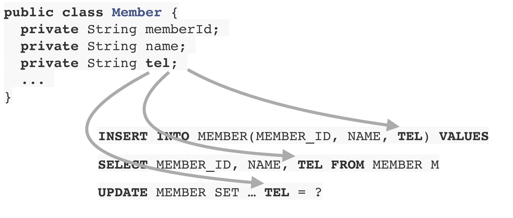

# JPA 소개

# 배경

- 무한 반복, 지루한 코드
- 기본 CRUD에 대한 코드를 테이블마다 생성하여 제작

Mybatis

- 필드 추가시 매퍼도 바꿔야되는 문제점 발생 ⇒ SQL에 의존적인 개발을 피하기 어렵다
- 패러다임의 불일치 객체 vs 관계형 데이터베이스(RDBS)
    - 객체지향 프로그래밍은 정보은닉, 캡슐화,상속 ,다형성 등 시스템의 복잡성을 제어할 수 있는 다양한 장치들을 제공
    - 데이터들을 관리해주는 곳 : 관계형 데이터베이스

- 객체를 관계형 데이터베이스에 추가 ⇒ 개발자가 SQL 매퍼의 일을 대신한다

## 객체와 관계형 데이터베이스의 차이

1. 상속
2. 연관 관계
3. 데이터 타입
4. 데이터 식별 방법

### 상속

- 상속된 객체를 테이블로 만들기 위해서는 오른쪽과 같이 슈퍼타입 서브타입 관계인 테이블을 생성
- ALbum 테이블의 데이터를 저장하기 위해서는 1. 객체분해 2. insert into item 3.insert into album을 해야지 저장 가능 ⇒ 상상만 해도 복잡하다 그래서 DB에 저장할 객체에는 상속 관계를 사용 X

## 처음 실행하는 SQL에 탐색 범위 결정

- member 객체에 order를 추가한뒤 검색을 한다면 찾지 못한다.

⇒ 엔티티 신뢰 문제가 발생

## 모든 객체를 미리 로딩 불가

- 상황에 따라 여러가지의 SQL을 메서드에 매핑하여 만들어야 되는 불편함 제공

## 요약

1. 객체 답게 모델링 할수록 매핑작업만 늘어난다.
2. 객체를 자바 컬렉션에 저장하는 방식으로 DB에 저장할수 는 없다..

# JPA

- JAVA Persistence API
- 자바 진영의 ORM 기술 표준

## ORM(Object- relational mappgin)

- 객체는 객체대로 설계
- 관계형 데이터베이스는 관계형 데이터베이스 대로 설계
- ORM 프레임워크가 중간에서 매핑

## JPA는 애플리케이션과 JDBC 사이에서 동작

## JPA 동작 -저장

- 핵심 : **패러다임 불일치 해결**
- API가 알아서 SQL 생성

# Why Use JPA

- SQL 중심적인 개발에서 객체 중심
- 생산성

    

- 유지보수 : JAP 필드만 추가하면 알아서 SQL 만들어줌

    

- 패러다임의 불일치 해결
    1. JPA와 상속
    2. JPA와 연관관계
    3. JPA와 객체 그래프 탐색
    4. JPA와비교하기
- 성능
    1. 1차 캐시와 동일성 보장
    2. 트랜잭션을 지원하는 쓰기 지연
    3. 지연 로딩
- 데이터 접근 추상화와 벤더 독립성
- 표준

### 1차 캐시와 동일성 보장

1. 같은 트랜잭션안에서는 같은 엔티티 반환
2. DB Isolation Level이 Read Commit이어도 애플리케이션에서 Repeatable Read 보장

### 트랜잭션을 지원하는 쓰기 지연

1. 트랜잭션을 커밋할때까지 Insert SQL 모음
2. JDBC BATCH SQL 기능을 사용해서 한번에 SQL 전송

### 지연 로딩 과 즉시 로딩

지연로딩: 객체가 실제 사용될때 로딩

즉시로딩: JOIN SQL로 한번에 연관된 객체까지 미리 조회

- 옵션을 설정하여 지연 로딩 or 즉시 로딩을 결정
- 상황에 따라 적절하게 사용 가능
