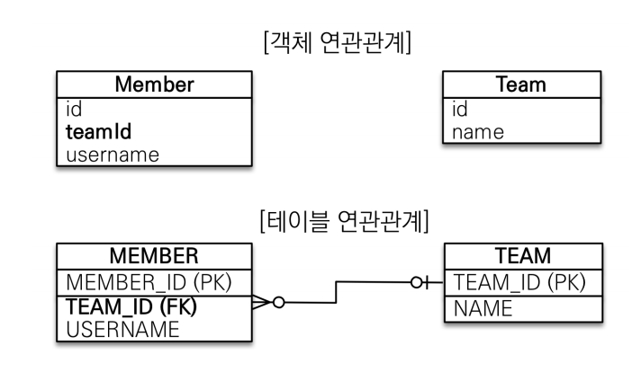

# 연관관계 매핑 기본

> ‘객체지향 설계의 목표는 자율적인 객체들의
협력 공동체를 만드는 것이다.
- 조영호

- 회원과 팀은 다대일 관계

# 연관관계가 없는 객체(객체를 테이블에 맞추어 모델링)



```java
//Member.class

@Entity
 public class Member { 
 @Id @GeneratedValue
 private Long id;
 @Column(name = "USERNAME")
 private String name;
 @Column(name = "TEAM_ID")
 private Long teamId; 
 … //Getter setter
 }
//Team.class

@Entity
 public class Team {
 @Id @GeneratedValue
 private Long id;
 private String name; 
 … 
 }

(외래키 식별자를 직접 다룸)
//팀 저장
 Team team = new Team();
 team.setName("TeamA");
 em.persist(team);
 //회원 저장
 Member member = new Member();
 member.setName("member1");
 member.setTeamId(team.getId()); // 외래키 식별자를 get으로 얻어와서 다시 집어넣기
 em.persist(member);
```

- 객체 지향적인 방법이 아니다.
- 데이터 중심으로 모델링하면 협력 관계를 만들 수 없다.
- 테이블은 외래 키로 조인을 사용해서 연관된 테이블을 찾는다
- 객체는 참조를 사용해서 연관된 객체를 찾는다.
- 테이블과 객체사이에는 이런 큰 간격이 있다.

# 단방향 연관관계

## 객체지향 모델링(객체 연관관계 사용)


```java
//Member.class 다대일 관계의 다에서 ManyToOne

@Entity
 public class Member { 
 @Id @GeneratedValue
 private Long id;
 @Column(name = "USERNAME")
 private String name;
 private int age;
// @Column(name = "TEAM_ID")
// private Long teamId;
 @ManyToOne
 @JoinColumn(name = "TEAM_ID")//조인하는 컬럼을 매칭
 private Team team;

```

- ORM 매핑


```java
//팀 저장
 Team team = new Team();
 team.setName("TeamA");
 em.persist(team);
 //회원 저장
 Member member = new Member();
 member.setName("member1");
 member.setTeam(team); //단방향 연관관계 설정, 참조 저장
 em.persist(member);
```

- 출력 결과

```java
Hibernate: 
    
    create table Member (
       MEMBER_ID bigint not null,
        USERNAME varchar(255),
        TEAM_ID bigint,
        primary key (MEMBER_ID)
    )
Hibernate: 
    
    create table Team (
       TEAM_ID bigint not null,
        name varchar(255),
        primary key (TEAM_ID)
    )
Hibernate: 
    
    alter table Member 
       add constraint FKl7wsny760hjy6x19kqnduasbm 
       foreign key (TEAM_ID) 
       references Team
```


- 연관관계 수정

```java
// 새로운 팀B
 Team teamB = new Team();
 teamB.setName("TeamB");
 em.persist(teamB);
 // 회원1에 새로운 팀B 설정
 member.setTeam(teamB);
```


# 양방향 매핑


```java
//Team.class

@Entity
 public class Team {
 @Id @GeneratedValue
 private Long id;
 private String name;
 @OneToMany(mappedBy = "team")
 List<Member> members = new ArrayList<Member>();
 … 
 }
```

- OneToMany를 이용하여 양방향 매핑
- mappedBy="team"은 Member의 team의 객체를 주인으로

## 객체와 테이블이 관계를 맺는 차이


## 객체의 양방향 관계

- 양방향 관계는 서로 다른 단방향이 2개라고 도 표현할 수 있다
- 객체를  양방향으로 참조하려면 단방향 연관관계를 2개 만들어야 한다.

## 테이블의 양방향 연관관계

- 테이블은 외래키 하나로 두 테이블의 연관관계를 관리
- MEMBER.TEAM_ID 외래키 하나로 양방향 연관관계를 가짐(양쪽 조인 가능)

## 둘 중 하나로 외래키를 관리해야된다.


- Team team 객체과 LIst members 둘다  등록 및 수정 가능하다.
- 하지만 하나로 외래키를 관리해야 좀더 편하다

## 연관관계의 주인

- 양방향 매핑 규칙
    - 객체의 두 관계중 하나를 연관관계의 주인으로 지정
    - 연관관계의 주인만이 외래 키를 관리(등록, 수정)
    - 주인이 아닌쪽은 읽기만 가능
    - 주인은 mappedBy 속성 사용X
    - 주인이 아니면 mappedBy 속성으로 주인 지정
- 외래 키가 있는 곳이 주인으로 정하자!!!! 즉 관계가 다인 쪽에게 주인

## 양방향 매핑시 주의 할점

- 연관관계의 주인에 값을 입력하지 않음

```java
Team team = new Team();
 team.setName("TeamA");
 em.persist(team);
 Member member = new Member();
 member.setName("member1");
 //역방향(주인이 아닌 방향)만 연관관계 설정
 team.getMembers().add(member);
//연관관계의 주인에 값 설정
member.setTeam(team);
 em.persist(member);
```

- 순수한 객체 관계를 고려하면 항상 양쪽다 값을 입력해야된다.

### 주의점

- 순수 객체 상태를 고려해서 항상 양쪽에 값을 설정
- 연관관계 편의 메소드를 생성하자

```
public void changeTeam(Team team) {
    this.team = team;
    team.getMembers().add(this);
}
```

- 양방향 매핑시에 무한 루프를 조심하자 ex) toString(),lombok,JSON 생성라이브러리

# 양방향 매핑 정리

- 단방향 매핑만으로도 이미 연관관계 매핑은 완료
- 반대 방향으로 조회(객체 그래프 탐색) 기능 추가
- JPQL에서 역방향으로 탐색할 일이 많음
- 단방향 매핑을 잘하고 양방향은 필요할 때 추가해도 됨
