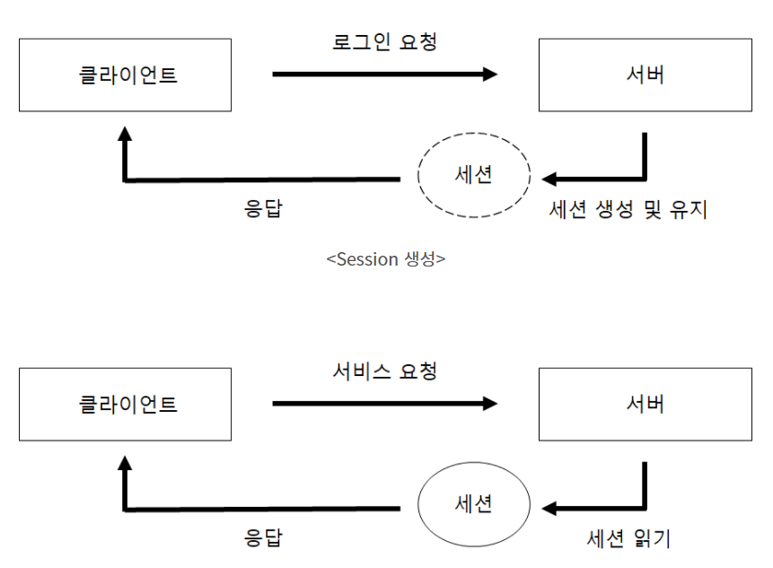
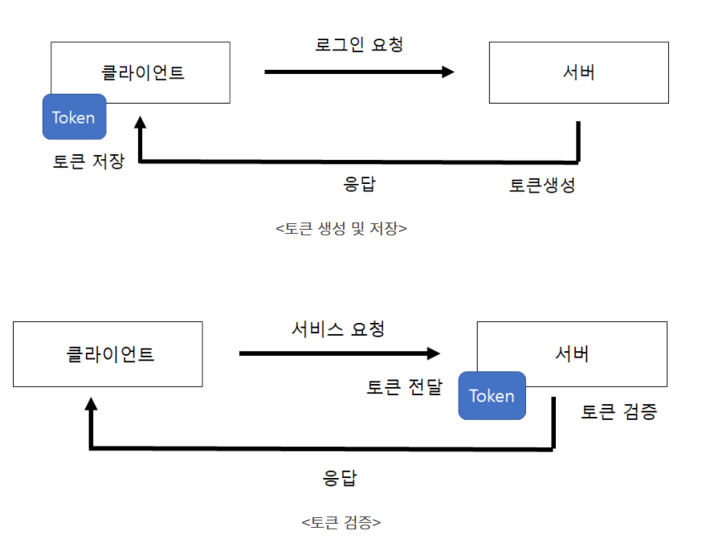

# JWT

# 🔒Json Web Token(JWT)

- JSON 객체를 통해 안전하게 정보를 전송할 수 있는 웹표준
- '.'을 구분자로 세 부분으로 구분되어 있는 문자열
- 헤더(header) : 토큰 타입+ 해싱알고리즘,
- 내용(payload) : 실제로 전달할 정보
- 서명(signature) : 위변조를 방지하기 위한 값

# Why Use JWT?

## 기본의 세션- 쿠키 기반의 로그인

- 하나의 서버 환경에서는 로그인 유지 및 관리가 편리하다. 하지만 서버의 규모가 커지는 순간 각각의 서버는 우리가 저장해둔 세션의 정보가 공유되어야한다. 이런 부분은 신경쓰이고 굉장히 복잡. → 서버나 DB에 부하를 줄 수 있다. CORS 문제도 해결해줘야된다.

## Token 기반

- 다중 서버 환경에서도 로그인을 유지할 수 있게 되고 한번의 로그인으로 유저정보를 공유하는 여러 도메인에서 사용할 수 있다는 장점
- 회원을 구분할 수 있는 정보가 담긴 곳은 JWT의 payload 부분이고 이곳에 담기는 정보의 한' 조각'을 Claim
- Claim은 name/value 한 쌍으로 이루어져 있으며 당연히 여러개의 Claim들을 넣을 수 있습니다.

## JWT 장단점

- 장점
  - 토큰을 사용하면 세션을 통한 방식과 달리 서버측 부하를 낮출 수 있고 능률적인 접근 권한 관리를 할 수 있으며 분산/클라우드 기반 인프라스트럭처에 더 잘 대응할 수 있습니다.

  - 별도의 인증 저장소가 필요가 없다. 그래서 인증 서버와 DB에 의존하지 않아도 된다. 

- 단점
  - 저장할 필드 수에 따라서 토큰이 커질 수 있다.

  - 토큰이 모든 요청에 대해 선송되면 데이터 트래픽 크기에 영향을 미칠 수 있다.
