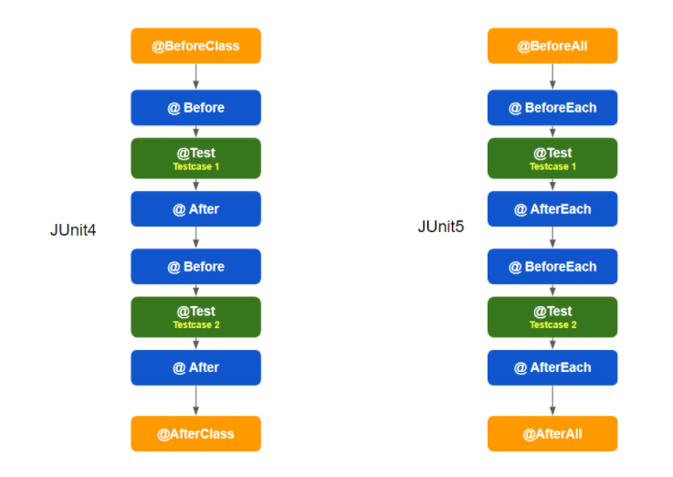

# Junit

> java의 단위 테스팅 도구
단 하나의 Jar파일로 되어 있다. Test Class를 그대로 남김으로써 추 후 개발자에게 테스트 방법 및 클래스의 History를 넘겨줄 수 있다.
> 



- jUnit4 = All in one : java5 , 하나의 jar파일을 가져와서 다른 라이브러리를 참조해서 사용하는 것!!

  **JUnit5 = JUnit Platform + JUnit Jupiter + JUnit Vintage : java8 (2017년 10월) 그자체로 모듈화가 되어있다. (스프링 2.2버전 이상부터 기본적으로 추가)**

  테스트 작성자를 위한 API 모듈과 테스트 실행을 위한 API가 분리

  ### JUnit Platform

  - JUnit Platform 은 JVM에서 테스트 프레임워크를 시작하기 위한 기반을 제공합니다.
  - 또한, 플랫폼에서 실행되는 테스트 프레임 워크 개발을 위한 TestEngine API를 정의합니다.
  - 모두가 잘 아는 IDEs(Intellj, Eclipse, VS Code), 빌드 도구(Gradle, Maven, Ant) 에서도 JUnit Platform을 지원합니다.

  ### JUnit Jupiter

  - JUnit Jupiter는 JUnit5에서 테스트 작성을 위한 새로운 프로그래밍 모델과 확장 모델 조합입니다.
  - 즉, 테스트를 하기 위한 것들이 포함되어 있다고 생각하면 됩니다.

  ### JUnit Vintage

  - 플랫폼에서 JUnit3, JUnit4기반한 테스트 코드가 실행될 수 있는 TeseEngine을 제공합니다.

  ## 특징

  - 단위 테스트 Framework 중 하나
  - [단정문](http://junit.sourceforge.net/javadoc/org/junit/Assert.html)으로 테스트케이스의 수행 결과를 판별
  - Annotation으로 간결하게 사용가능

  ## 어노테이션

  ### 초기화

  ```java
  @Before
  pulbic void Setup(){
  //setup before testing
  }
  ```

  @Before 어노테이션을 이용하면 테스트 클래스 안의 메소들이 테스트 전에 실행할 코드를 정의

  @BeforeClass 어노테이션을 사용한다면 메소드들이 몇번 실행되건 테스트 전 해당클래스에서 단 한번만  실행하도록 할 수 있다.

  ### 해제

  ```java
  @After
  public void tearDown(){
   //teardown after testing
  }
  ```

  @After 어노테이션을 선언한다면 테스트 클래스 안의 메소드들이 테스트 후 실행할 코드를 정의

  @AfterClass 어노테이션을 사용한다면 메소드들이 몇번 실행되건 테스트 전 해당클래스에서 단 한번만  실행하도록 할 수 있다.

  ### 테스트 메소드

  ```java
  //junit4 
  @Test(excepted=RuntimeException.class)
  public void testSum(){
  //testing
  }
  
  //junit5
  @Test
  public void testSum(){
  //testing
  }
  ```

  @Test 어노테이션을 선언하면 메소드를 테스트 대상으로 지정할 수 있다.

  junit 5 는 어떠한 속성을 사용하지 않는다.

  ### 테스트 메소드 수행시간 제한

  ```java
  @Test(timeout=5000)
  public void testSum(){
  //testing
  }
  ```

  @Test(timeout=mili second)어노테이션을 선언하면 밀리 초 단위로 메소드의 수행시간을 제한하여 테스트

  ### 테스트 메서드에 Exception

  ```java
  @Test(excepted=RuntimeException.class)
  public void testSum(){
  //testing
  }
  ```

  @Test(excepted=exception.class)선언하면 선언된 exceptiong을 발생시켜야 테스트가 성공되도록 함

  # Junit5 annotation

  - **@Test** : 메서드가 테스트 메서드임을 나타냅니다.
  - **@ParameterizedTest** : 메서드가 매개 변수가 있는 테스트임을 나타냅니다. (매개 변수를 대입해가며 반복 실행할 때 사용)
  - **@RepeatedTest** : 반복 테스트를 위한 메소드임을 나타냅니다.
  - **@TestFactory** : 동적 테스트를 위한 테스트 팩토리 메소드를 나타냅니다.
  - **@TestTemplate** : 여러번 호출되도록 설계된 테스트 케이스의 템플릿임을 나타냅니다.
  - **@TestMethodOrder** : 테스트 메소드 실생 순서를 구성하는데 사용됩니다.
  - **@TestInstance** : 테스트 라이프 사이플을 구성하는데 사용됩니다.
  - **@DisplayName** : 테스트 클래스 또는 테스트 메서드에 대한 사용자 지정 표시 이름을 설정합니다. (가장 많이 사용한다. 새로추가) → 공백 emoji, 특수문자 등을 모두 지원
  - **@DisplayNameGeneration** : 테스트 클래스에 대한 커스텀 이름 생성기를 생성합니다.
  - **@BeforeEach** : 모든 테스트 메소드 실행 전에 실행되는 메소드입니다. (매 테스트 실행될때마다 실행이되므로 조건이 다른 테스트에 영향을 끼칠때 사용하는 것이 좋다)
  - **@AfterEach** : 모든 테스트 메소드 실행이 끝나면 실행되는 메소드입니다.
  - **@BeforeAll** : 하나의 테스트 실행 전에 실행되는 메소드입니다. (한번만 실행 , 조건에 비해 어떠한 변경을 하지 않고 확신할때)
  - **@AfterAll** : 하나의 테스트 실행이 끝나면 실행되는 메소드입니다.
  - **@Nested** : non-static 중첩 클래스임을 나타냅니다. (계층별로 나눌때 사용)
  - **@Tag** : 새로운 태그를 선언할 때 사용됩니다.
  - **@Disable** : 테스트 클래스나 테스트 메소드를 사용하지 않도록 할 때 사용됩니다.
  - **@Timeout** : 주어진 시간안에 실행을 못할 경우 실패하도록 하는데 사용됩니다.

  # Assert Method

  - 테스트 케이스의 수행 결과를 판별하는 메서드
  - 모든 Junit Jupiter Assertions 는 static 메서드

  ------

  - **assertEquals(x,y)** : 객체 x,y가 일치함을 확인합니다.
  - **assertArayEquals(a,b)** : 배열 A와 B가 일치함을 확인합니다.
  - **assertFalse(x)** : x가 false인지 확인합니다.
  - **assertTrue(x)** : x가 True인지 확인합니다.
  - **assertNull(x)** : 객체 x가 null인지 확인합니다.
  - **seertNotNull(x)** : 객체 x가 null이 아닌지 확인합니다.
  - **assertSame(x,y)** : 객체 x와 y가 같은 객체의 레퍼런스임을 확인합니다. (30 != 30.0)
  - **asswertNotSame(x,y)** : 객체 x와 y가 같은 객체의 레퍼런스가 아닌지 확인합니다.
  - **asserfail()** : 테스트를 실패 처리합니다.

  ### junit 5에 추가된것

  1. assertAll : 오류가 나도 끝까지 실행 ( 모든 테스트 코드를 한번에실행)

  ```java
  @Test
  pulbic void create_study(){
  	Study study=new Study();
  assertNotNull(study);
  assertEquals();
  assertTrue();
  }
  
  @Test
  public void create_study(){
  	Study study=new Study();
  	assertAll(
  	()-> assertNotNull(),
  	()-> assertEquals(),
  	()-> assertTrue();
  	);
  }
  ```

  2. assertThrows

  - 예외 발생을 확인하는 테스트
  - executable의 로직이 실행하는 도중 expectedType의 에러를 발생시키는 지 확인

  ```java
  //junit4 : 단순히 이 예외를 발생하는지만 판단
  @Test(expect= Exception.class)
  void create() throws Exception{
  ...
  }
  
  //junit5
  @Test
  void exceptionThrow(){
  	Exception e= assertThrows();
  	assertDoesNotThrow(); 
  }
  ```

  

  3. assertTimeout(duration,executable)

  - 특정시간 안에 실행이 완료되는 지 확인
  - Durtaion 원하는 시간
  - Executable 테스트할 로직

  

  

  4. Assumption

  - 전제문이  ture라면 실행 false 종료
  - assumTure : false일 때 이후 테스트 전체가 실행되지 않음
  - assumingThat : 파라미터로 전달된 코드 블럭만 실행되지 않음

  ```java
  void dev_env_only(){
  	assumeTure()
  	assertEquals() //실행 X
  }
  
  void some_test(){
  	assumingThat()
  	assertEquals()//실행 O
  }
  ```