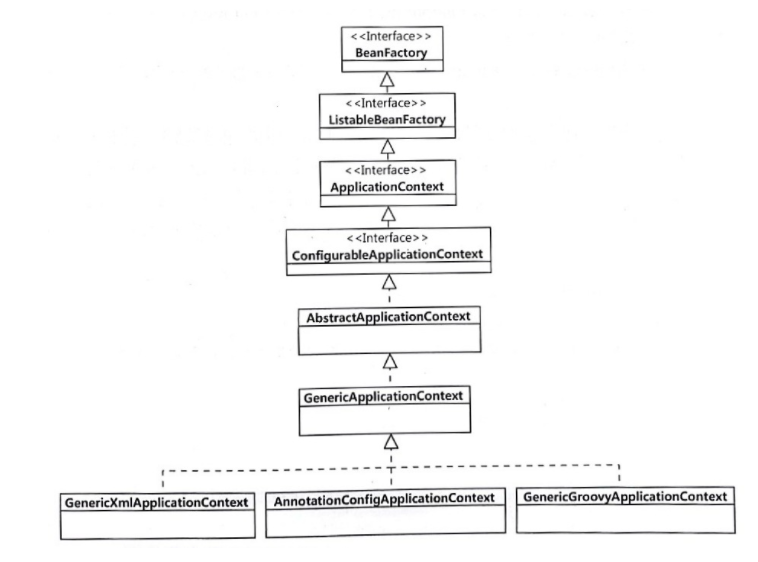
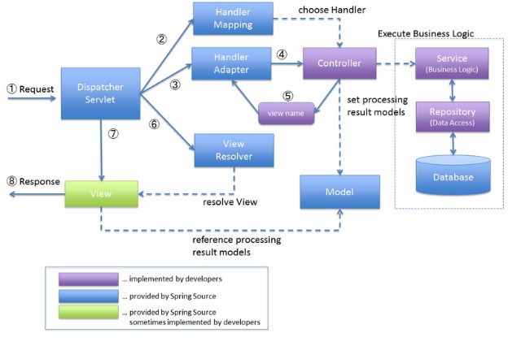

# Spring Framework

# 🗯️등장배경

1. EJB를 사용하여 컨테이너를 관리하고 엔터프라이즈 애플리케이션을 개발을 해야되는 데 무겁다..
2. 좀더 경량화되고 간소화된 컨테이너를 선호.
3. POJO ( 일반 자바 클래스)
4. Spring 등장

# ☝️IoC패턴 활용

- 프로그램의 생명 주기에 대한 주도권이 웹 애플리케이션 컨테이너에 있다.
- 디자인 패턴의 원칙 중에는 의존 관계 역전 원칙.
    1. 하이레벨 모듈은 로우레벨 모듈에 의존해서는 안되고 모두 인터페이스에 의존해야 한다.
    2. 추상화는 세부 사항에 의존해서는 안된다. → 인터페이스를 활용해 결합도를 낮추게 하자
- 자바에는 인스턴스화하기 위해서는 객체 생성에 필요한 코드가 수반된다.  —> DI - 의존성 주입

## 인터페이스 사용

```java
//인터페이스 
public interface WorkManager {
    public String doIt();
}

import javax.annotation.PostConstruct;
import javax.annotation.PreDestroy;

public class WorkService {
    WorkManager workManager;

    public void setWorkManager(WorkManager workManager){
        this.workManager = workManager;
    }

    public void askWork(){
        System.out.println( workManager.doIt() );
    }

    @PostConstruct
    public void onCreated() {
        System.out.println("초기화 되었을 때");
    }

    @PreDestroy
    public void onDestroyed() {
        System.out.println("종료되었을 때");
    }
}

public class BasicApp {
    public static void main(String ar[]){
        WorkService workService = new WorkService();
        WorkManager employee = new Employee();
        WorkManager boss = new Boss();

        workService.setWorkManager(employee);
        workService.askWork();

        workService.setWorkManager(boss);
        workService.askWork();
    }
}
```

- asWork 메서드를 사용할려면 Boss와 Emplyee의 인스턴스 생성이 필요하다..
- 각각의 필요한 인스턴스를 생성해야된다..

## 스프링 XML 설정

- 스프링 컨테이너에 클래스를 등록하면 스프링이 클래스의 인스턴스를 관리
- 빈을 등록하고 설정하는 방법  XML과 Annotation

```xml
<?xml version="1.0" encoding="UTF-8" ?>
<beans xmlns="http://www.springframework.org/schema/beans"
       xmlns:xsi="http://www.w3.org/2001/XMLSchema-instance"
       xsi:schemaLocation="http://www.springframework.org/schema/beans http://www.springframework.org/schema/beans/spring-beans.xsd">

    <bean id="boss" class="basic.Boss" init-method="onCreated" destroy-method="onDestroyed"></bean>
    <bean id="employee" class="basic.Employee" init-method="onCreated" destroy-method="onDestroyed"></bean>

    <bean id="myWorkService" class="basic.WorkService">
        <property name="workManager">
            <ref bean="boss"/>
        </property>
    </bean>

    <bean id="yourWorkService" class="basic.WorkService">
        <property name="workManager">
            <ref bean="employee"/>
        </property>
    </bean>

</beans>
```

- beam 태그
    - class : 실제 클래스 파일 경로
    - id : 참조에 사용할 값을 입력 ( 보통 id값은 클래스명의 소문자 형태로 입력)
    - new 연산자를 이용해서 인스턴스를 생성 했던 작업을 스프링에 위임한다.
    - init-method : 생성시점
    - destory-method : 소멸되는 시점

```java
import basic.WorkService;
import org.springframework.context.support.GenericXmlApplicationContext;

public class XmlSpringApp {
    public static void main(String ar[]){
				
        GenericXmlApplicationContext context = new GenericXmlApplicationContext(
                "classpath:applicationContext.xml"
        );

        WorkService myWorkService = context.getBean("myWorkService", WorkService.class);
        myWorkService.askWork();

        WorkService yourWorkService = context.getBean("yourWorkService", WorkService.class);
        yourWorkService.askWork();
				
				//main을 정상적으로 종료
        context.close();
    }
}
```

- XML 설정을 이용하려면 GenericXmlApplicationContext



## 스프링 JavaConfig

### @Configuration 어노테이션

- 빈 설정 정보가 포함된 클래스임을 명시
- <bean> 태그 ⇒ @Bean로 대체

```java
import org.springframework.context.annotation.Bean;
import org.springframework.context.annotation.Configuration;
import org.springframework.context.annotation.Import;

@Configuration
@Import(CompanyConfig.class)
public class BeanConfig {
    @Bean
    public WorkManager employee() {
        return new Employee();
    }

    @Bean
    public WorkManager boss() {
        return new Boss();
    }

    @Bean
    public WorkService yourWorkService() {
        WorkService workService = new WorkService();
        workService.setWorkManager(employee());
        return workService;
    }

    @Bean
    public WorkService myWorkService() {
        WorkService workService = new WorkService();
        workService.setWorkManager(boss());
        return workService;
    }
}

```

```java
public class JavaConfigSpringApp {
    public static void main(String ar[]){
        AnnotationConfigApplicationContext context = new AnnotationConfigApplicationContext();
        context.register(BeanConfig.class);
        context.refresh();

        WorkService yourWorkService = context.getBean("yourWorkService", WorkService.class);
        yourWorkService.askWork();

        WorkService myWorkService = context.getBean("myWorkService", WorkService.class);
        myWorkService.askWork();

        context.close();
    }
}
```

- AnnotationConfigApplicationContext()을 이용하여 @Bean 어노테이션 로드

### 생명 주기 제어

```java
//생성
@PostConstruct
public void onCreated(){
}
//소멸
@PreDestroy
public void onDestroyed(){
}

```

# 스프링 MVC



스프링 mvc 요청 처리 흐름도

## Dispatcher Servlet 설정

1. web.xml
2. bean에 추가

## 컨트롤러와 뷰

```java
@Controller
public class IndexController {

	@RequestMapping("/")
    public ModelAndView home(){
       // return new ModelAndView("home");
        ModelAndView mv=new ModelAndView("home");
        mv.addObject("title", "Jpub Spring WEB");
        mv.addObject("today", new Date().toString());

        return mv;
    }
}
```

# 인터셉터

- 컨트롤러가 요청을 처리하기 전 혹은 후에 대해 로직을 추가할 수 있다.

1. HandlerInterceptorAdaptor 

```java
public class JpubInterceptor extends HandlerInterceptorAdapter {
    @Override
    public boolean preHandle(HttpServletRequest request, HttpServletResponse response, Object handler) throws Exception {
        System.out.println("preHandle 메소드 실행");
        return true;
    }

    @Override
    public void postHandle(HttpServletRequest request, HttpServletResponse response, Object handler, ModelAndView modelAndView) throws Exception {
        System.out.println("postHandle 메소드 실행");
    }

    @Override
    public void afterCompletion(HttpServletRequest request, HttpServletResponse response, Object handler, Exception ex) throws Exception {
        System.out.println("afterCompletion 메소드 실행");
    }

    @Override
    public void afterConcurrentHandlingStarted(HttpServletRequest request, HttpServletResponse response, Object handler) throws Exception {
        super.afterConcurrentHandlingStarted(request, response, handler);
    }
}
```
