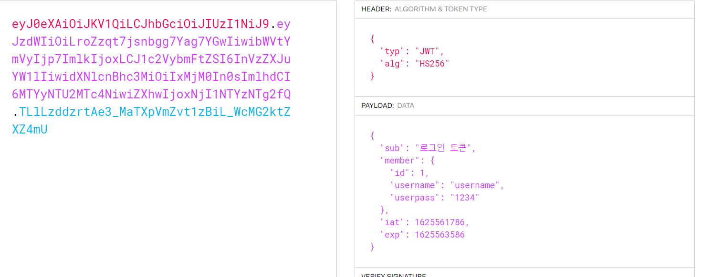

# JWT 실습

# JWT 환경 설정

## maven

```java
<dependency>
    <groupId>io.jsonwebtoken</groupId>
    <artifactId>jjwt</artifactId>
    <version>0.9.1</version>
</dependency>
```

## gradle

`implementation 'io.jsonwebtoken:jjwt:0.9.1'`

## security 사용 X, jWT 만사용+Mybatis

### JwtService.java

```java
@Component
public class JwtService{	
	public static final Logger logger=LoggerFactory.getLogger(JwtService.class);
	
	private String signature="VUETOKEN";
	private Long expireMin=5L;

	//로그인 성공시 사용자 정보를 기반으로 JWTToken을 생성하여 반환.
	public String create(UserDto userDto) {
		JwtBuilder jwtBuilder=Jwts.builder();
		//JWT Token=Header+Payload+Signature
		
		//Header 설정
		jwtBuilder.setHeaderParam("typ", "JWT"); // 토큰의 타입으로 고정 값.

		//Payload 설정
		jwtBuilder.setSubject("로그인토큰") // 토큰의 제목 설정
			      .setExpiration(new Date(System.currentTimeMillis()+1000*60*expireMin)) // 유효기간 설정
			      .claim("user", userDto)
			      .claim("greeting", "환영합니다. "+userDto.getUsername()); // 담고 싶은 정보 설정.
		
		//signature 설정
		jwtBuilder.signWith(SignatureAlgorithm.HS256, signature.getBytes());
		
		//마지막 직렬화 처리 compact하는 시간이 오래걸린다.
		String jwt=jwtBuilder.compact();
		logger.info("jwt : {}", jwt);
		return jwt;
	}
	
	//전달 받은 토큰이 제대로 생성된것이니 확인하고 문제가 있다면 RuntimeException을 발생.
	public void checkValid(String jwt) {
		//예외가 발생하지 않으면 OK
		Jwts.parser().setSigningKey(signature.getBytes()).parseClaimsJws(jwt);
	}
	
	//JWT Token을 분석해서 필요한 정보를 반환.
	public Map<String, Object> get(String jwt) {
        Jws<Claims> claims = null;
        try {
            claims = Jwts.parser().setSigningKey(signature.getBytes()).parseClaimsJws(jwt);
        } catch (final Exception e) {
            throw new RuntimeException();
        }

        logger.info("claims : {}", claims);
        // Claims는 Map의 구현체이다.
        return claims.getBody();
    }
}
```

## Controller

```java
/* login*/
	@PostMapping("/confirm/login")
	public ResponseEntity<Map<String, Object>> login(@RequestBody UserDto userDto, HttpServletResponse response, HttpSession session) {
		Map<String, Object> resultMap=new HashMap<>();
		HttpStatus status=null;
		try {
			UserDto loginUser=uService.login(userDto);
			if(loginUser!=null){
				//jwt.io에서 확인
				//로그인 성공했다면 토큰을 생성한다.
				String token=jwtService.create(loginUser);
				logger.trace("로그인 토큰정보 : {}", token);
				
				//토큰 정보는 response의 헤더로 보내고 나머지는 Map에 담는다.
				//response.setHeader("auth-token", token);
				resultMap.put("auth-token", token);
				resultMap.put("user-id", loginUser.getUserid());
				resultMap.put("user-name", loginUser.getUsername());
				resultMap.put("user-code", loginUser.getCode());
				//resultMap.put("status", true);
				//resultMap.put("data", loginUser);
				status=HttpStatus.ACCEPTED;
			}else{
				resultMap.put("message", "로그인 실패");
				status=HttpStatus.ACCEPTED;
			}
		}catch(Exception e){
			logger.error("로그인 실패 : {}", e);
			resultMap.put("message", e.getMessage());
			status=HttpStatus.INTERNAL_SERVER_ERROR;
		}
		return new ResponseEntity<Map<String, Object>>(resultMap, status);
	}
	/*정보 가져오기*/
	@GetMapping("/info")
	public ResponseEntity<Map<String, Object>> getInfo(HttpServletRequest req) {
		Map<String, Object> resultMap=new HashMap<>();
		HttpStatus status=HttpStatus.ACCEPTED;
		System.out.println(">>>>>> "+jwtService.get(req.getHeader("auth-token")));
		try {
			// 사용자에게 전달할 정보이다.
			//String info=memberService.getServerInfo();
			//resultMap에다가 합치기 Map+Map
			resultMap.putAll(jwtService.get(req.getHeader("auth-token")));

			//resultMap.put("status", true);
			//resultMap.put("info", info);
			status=HttpStatus.ACCEPTED;
		}catch(RuntimeException e){
			logger.error("정보조회 실패 : {}", e);
			resultMap.put("message", e.getMessage());
			status=HttpStatus.INTERNAL_SERVER_ERROR;
		}
		return new ResponseEntity<Map<String, Object>>(resultMap, status);
	}
```

# 내가 만들어본 jwt Service

```java
package com.example.jwt.Service;

import com.example.jwt.entity.Member;
import io.jsonwebtoken.Claims;
import io.jsonwebtoken.Jws;
import io.jsonwebtoken.Jwts;
import io.jsonwebtoken.SignatureAlgorithm;
import org.springframework.security.authentication.UsernamePasswordAuthenticationToken;
import org.springframework.security.core.Authentication;
import org.springframework.stereotype.Component;

import javax.annotation.PostConstruct;
import javax.servlet.http.HttpServletRequest;
import java.util.Base64;
import java.util.Date;
import java.util.List;

@Component
public class JwtTokenProvider {

    private String secretKey= "secretKey설정";

    //토큰 유효시간 30분
    private long tokenValidTime=30*60*1000L;

    private MemberService memberService;

    @PostConstruct
    protected void init(){
        secretKey= Base64.getEncoder().encodeToString(secretKey.getBytes());
    }

    //JWT 토큰 생성
    public String createToken(Member member){
        Claims claims = Jwts.claims().setSubject("로그인 토큰");
        // claim : JWT payload 에 저장되는 정보단위
        claims.put("member",member);

        Date now = new Date();
        return Jwts.builder()
                .setHeaderParam("typ","JWT")
                .setClaims(claims) // 정보 저장
                .setIssuedAt(now) // 토큰 발행 시간 정보
                .setExpiration(new Date(now.getTime() + tokenValidTime)) // set Expire Time
                .signWith(SignatureAlgorithm.HS256, secretKey.getBytes())
                // 사용할 암호화 알고리즘과
                // signature에 들어갈 secret값 세팅-> secret값은 byte로 해야된다.
                .compact();
    }

    //JWT 토큰에서 인증 정보 조회
    public Authentication getAuthentication(String token){
        Member member=memberService.loadUserByUsername(this.getUserPk(token));
        return new UsernamePasswordAuthenticationToken(member,"");
    }

    // 토큰에서 회원 정보 추출
    public String getUserPk(String token) {
        return Jwts.parser().setSigningKey(secretKey.getBytes()).parseClaimsJws(token).getBody().getSubject();
    }

    // Request의 Header에서 token 값을 가져옴. "X-AUTH-TOKEN" : "TOKEN값'
    public String resolveToken(HttpServletRequest request) {
        return request.getHeader("X-AUTH-TOKEN");
    }

    // 토큰의 유효성 + 만료일자 확인
    public boolean validateToken(String jwtToken) {
        try {

            Jws<Claims> claims = Jwts.parser().setSigningKey(secretKey.getBytes()).parseClaimsJws(jwtToken);
            System.out.println(claims.getBody());
            return !claims.getBody().getExpiration().before(new Date());
        } catch (Exception e) {
            return false;
        }
    }
    //토큰의 유효성 체크
    public void checkValid(String jwt) {
        //예외가 발생하지 않으면 OK
        Jwts.parser().setSigningKey(secretKey.getBytes()).parseClaimsJws(jwt);
    }
    public static void main(String[] args) {
        JwtTokenProvider jwtTokenProvider=new JwtTokenProvider();
        String jwt=jwtTokenProvider.createToken(new Member(1,"username","1234"));
        System.out.println(jwt);
        System.out.println(jwtTokenProvider.validateToken(jwt));
        jwtTokenProvider.checkValid(jwt);
    }
}
```

## JWT.io

- jwt.io를 이용하여 생성된 jwt 토큰을 확인



# Security +JWT

[참고](https://oingdaddy.tistory.com/206)

## Configuration vs Componet

[참고](https://mangkyu.tistory.com/75)

### Configuration

@Bean을 사용하는 클래스에는 반드시 @Configuration 어노테이션을 활용하여 해당 클래스에서 Bean을 등록하고자 함을 명시해주어야 한다.

- 개발자가 직접 제어가 불가능한 외부 라이브러리 또는 설정을 위한 클래스를 Bean으로 등록할 때 @Bean 어노테이션을 활용
- 1개 이상의 @Bean을 제공하는 클래스의 경우 반드시 @Configuration을 명시해 주어야 함

### Componet

직접 개발한 클래스를 Bean으로 등록하고자 하는 경우

## UserDatailService

[참고](https://to-dy.tistory.com/86)

UserDetailsService 인터페이스는 DB에서 유저 정보를 가져오는 역할을 한다. 해당 인터페이스의 메소드에서 DB의 유저 정보를 가져와서 AuthenticationProvider 인터페이스로 유저 정보를 리턴하면, 그 곳에서 사용자가 입력한 정보와 DB에 있는 유저 정보를 비교한다
