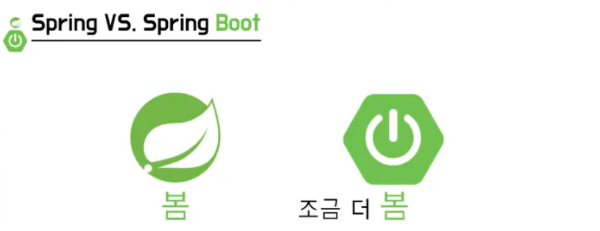

# Spring vs Spring boot

# 🗨️Spring

- 자바 생태계에서 가장 대중적인 응용프로그램 개발 프레임 워크

## 등장 배경

a) 의존성 주입

- 객체간 결합을 느슨하게 만듦
- 코드 재사용성 증가 및 단위 테스트가 용이

b) 중복된 코드 제거

c) 다른 프레임워크와의 통합 

ex) JUnit

## 특징

1. DI(Dependency Injection) : 의존성 주입
2. IOC(Inversion Of Control) : 제어의 역전

결합도를 낮추는 방식으로 어플리케이션을 개발!!! → 단위테스트가 용이

# 💬 Spring boot

- Transaction Manager, Hibernate Datasource, Entity Manager, Session Factory와 같은 설정을 하는데에 어려움이 많이 있었습니다
- 최소한의 기능으로 Spring MVC를 사용하여 기본 프로젝트를 셋팅하는데 개발자에게 너무 많은 시간이 걸렸습니다.

## 문제 해결방법

1. 자동설정(AutoConfiguration) - 어플리케이션 개발에 필요한 모든 내부 디펜던시를 관리

 → 개발자가 해야하는 건 단지 어플리케이션 실행뿐!!

2. 이러한 jar들의 서로 호환되는 버전들을 따로 선택을 해주어야 했습니다. 이런 복잡도를 줄이기 위해서 스프링 부트는 SpringBoot Starter라고 불리는 것을 도입했습니다.

- **Spring Boot Starter 프로젝트 옵션들**

스타터 프로젝트들은 특정 애플리케이션 개발을 빠르게 시작할 수 있도록 도와준다.

-. spring-boot-starter-web-services: SOAP Web Services

-. spring-boot-starter-web: Web and RESTful applications 

-. spring-boot-starter-test: Unit testing and Integration Testing 

-. spring-boot-starter-jdbc: Traditional JDBC 

-. spring-boot-starter-hateoas: Add HATEOAS features to your services 

-. spring-boot-starter-security: Authentication and Authorization using Spring Security 

-. spring-boot-starter-data-jpa: Spring Data JPA with Hibernate 

-. spring-boot-starter-cache: Enabling Spring Framework’s caching support 

-. spring-boot-starter-data-rest: Expose Simple REST Services using Spring Data REST

- **해결하고자 하는것**

a) Auto Configuration 자동 실행

b) 쉬운 의존성 관리

c) 내장 서버

# 요약

- Spring, Spring Boot는 **라이브러리** 가 아닌 **프레임워크** 이다. 단순히 코드를 제공하는 것이 아니라 **프로그래밍 방법** 을 제공한다
