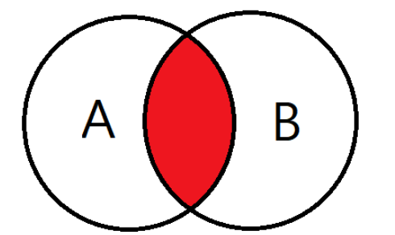

# SQL

# CRUD

## db

1. 생성 : CREATE DATABASE <생성할 DB명>;
2. 조회 : SHOW DATABASES;
3. 사용 : USE <사용할 DB명>;
4. 삭제 : DROP DATABASE <삭제할 DB명>;

## table

1. INSERT INTO person(name, age) VALUES(“Tony”, 25);
2. SELECT * FROM person;
3. UPDATE <table 명> SET field1=데이터1, … WHERE <조건>;
4. DELETE FROM person WHERE id=4;

NULL에 대한 판단

SELECT " 필드명" FROM TABLE WHERE "필드명" IS NULL

반대 조회

SELECT " 필드명" FROM TABLE  WHERE "필드명" IS NOT NULL

MAX 

SELECT MAX("필드명") FROM TABLE

MIN

SELECT MIN("필드명") FROM TABLE

COUNT

SELECT COUNT("필드명") FROM TABLE

중복 제거 DISTINT

SELECT COUNT(DISTINT " 필드명") FROM TABLE

BETWEEN 으로 50이상 59이하 

SELECT "레코드명" FROM TABLE WHERE "레코드명" BETWEEN 50 AND 59

# Join

조인이란 ?

> 두 개 이상의 테이블이나 데이터 베이스를 연결하여 데이터를 검색하는 방법

테이블을 연결하려면, 적어도 하나의 칼럼을 서로 공유하고 있어야 하므로 이를 이용하여 데이터 검색에 활용한다.

## Join 종류

---

- INNER JOIN
- LEFT OUTER JOIN
- RIGHT OUTER JOIN
- FULL OUTER JOIN
- CROSS JOIN
- SELF JOIN

### INNER JOIN



교집합, 중복된 값을 보여준다.

```sql
SELECT
A.NAME, B.AGE
FROM EX_TABLE A
INNER JOIN JOIN_TABLE B ON A.NO_EMP = B.NO_EMP
```

### LEFT OUTER JOIN


- 기준 테이블 값과 조인 테이블과 중복된 값을 보여준다.
- 왼쪽 테이블 기준으로 JOIN을 한다~~

```sql
SELECT
A.NAME, B.AGE
FROM EX_TABLE A
LEFT OUTER JOIN JOIN_TABLE B ON A.NO_EMP = B.NO_EMP
```

### RIGHT OUTER JOIN


- LEFT OUTER JOIN과는 반대로 오른쪽 테이블기준으로 JOIN
- 기준 테이블 값과 조인 테이블과 중복된 값을 보여준다.

```sql
SELECT
A.NAME, B.AGE
FROM EX_TABLE A
RIGHT OUTER JOIN JOIN_TABLE B ON A.NO_EMP = B.NO_EMP
```

### FULL OUTER JOIN


- 합집합

```sql
SELECT
A.NAME, B.AGE
FROM EX_TABLE A
FULL OUTER JOIN JOIN_TABLE B ON A.NO_EMP = B.NO_EMP
```

### CROSS JOIN


- 모든 경우의 수를 전부 표현해주는 방식
- A =3 B=4 12개의 데이터 검색

```sql
SELECT
A.NAME, B.AGE
FROM EX_TABLE A
CROSS JOIN JOIN_TABLE B
```

### SELF JOIN


- 자기 자신과 자기 자신을 조인한다.
- 하나의 테이블을 여러번 복사해서 조인~!
- 다양하게 변형시킬때 활용

```sql
SELECT
A.NAME, B.AGE
FROM EX_TABLE A, EX_TABLE B
```

---

참고

[https://coding-factory.tistory.com/87](https://coding-factory.tistory.com/87)
