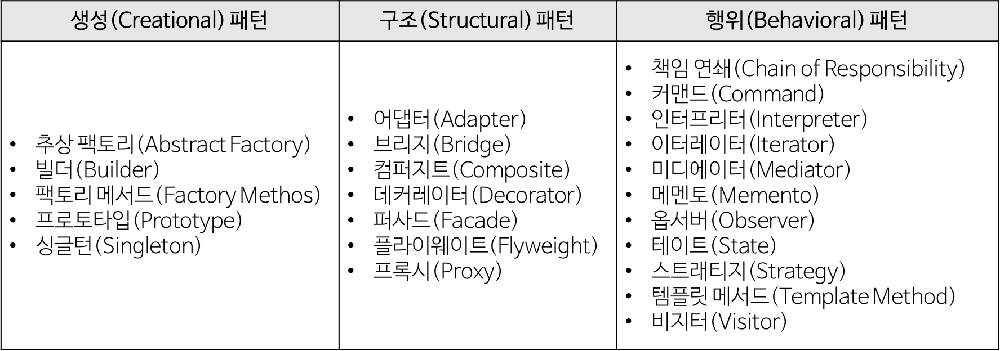

# 디자인 패턴

# 디자인 패턴

- 자주 사용하는 설계형태를 정형화해서 이를 유형별로 설계 템플릿을 만들어둔 것
- 많은 개발자들이 경험상 체득한 설계 지식을 검증하고 이를 추상화하여 일반화한 템플릿

## 장점

- 개발자 간의 원활한 의사소통
- 소프트웨어 구조 파악 용이
- 재사용을 통한 개발 시간 단축
- 설계 변경 요청에 대한 유연한 대처

## 단점

- 객체지향 설계/구현 위주
- 초기 투자 비용 부담

## Gof 디자인 패턴

- Creational Pattern
    - 객체를 생성하는데 관련된 패턴들
    - 객체가 생성되는 과정의 유연성을 높이고 코드의 유지를 쉽게 함

    ### 종류

    - 추상 팩토리(Abstract Factory)
        - 구제적인 클래스에 의존하지 않고 서로 연관되거나 의존적인 객체들의 조합을 만드는 인터페이스를 제공하는 패턴
    - 팩토리 메서드(Factory Method)
        - 객체 생성 처리를 서브 클래스로 분리해 처리하도록 캡슐화하는 패턴
    - 싱글턴(Singleton)
        - 전역 변수를 사용하지 않고 객체를 하나만 생성하도록 하며, 생성된 객체를 어디에서든지 참조할 수 있도록 하는 패턴
- Structural Pattern
    - 프로그램 구조에 관련된 패턴들
    - 프로그램 내의 자료구조나 인터페이스 구조 등 프로그램의 구조를 설계하는데 활용할 수 있는 패턴들

    ### 종류

    - 컴퍼지트(Composite)
        - 여러 개의 객체들로 구성된 복합 객체와 단일 객체를 클라이언트에서 구별 없이 다루게 해주는 패턴
    - 데커레이터(Decorator)
        - 객체의 결합을 통해 기능을 동적으로 유연하게 확장할 수 있게 해주는 패턴

- Behavioral Pattern
    - 반복적으로 사용되는 객체들의 상호작용을 패턴화 해놓은 것들

    ### 종류

    - 옵서버(Observer)
        - 한 객체의 상태 변화에 따라 다른 객체의 상태도 연동되도록 일대다 객체 의존 관계를 구성하는 패턴
    - 스테이트(State)
        - 객체의 상태에 따라 객체의 행위 내용을 변경해주는 패턴
    - 스트래티지(Strategy)
    =
        - 행위를 클래스로 캡슐화해 동적으로 행위를 자유롭게 바꿀 수 있게 해주는 패턴
    - 템플릿 메서드(Template Method)
        - 어떤 작업을 처리하는 일부분을 서브 클래스로 캡슐화해 전체 일을 수행하는 구조는 바꾸지 않으면서 특정 단계에서 수행하는 내역을 바꾸는 패턴
    - 커맨드(Command)
        - 실행될 기능을 캡슐화함으로써 주어진 여러 기능을 실행할 수 있는 재사용성이 높은 클래스를 설계하는 패턴
