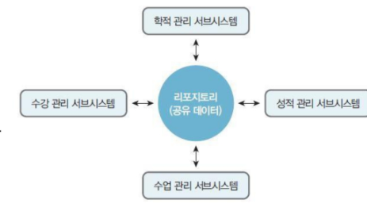
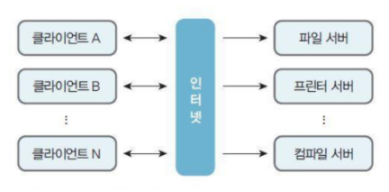

# 소프트웨어 아키텍쳐

# 소프트웨어 아키텍쳐

- 주로 서버를 중심으로 동작되는 소프트웨어들의 논리적 형상에 대한 "구조"를 설명한다

---

# 🐥아키텍쳐 모델

## 데이터 중심형 모델

- repository model
- 주요 데이터가 repository에서 중앙관리
- repository와 여기에 접근하는 서브시스템으로 구성
- 데이터가 한군데에 모여 있기 때문에 데이터를 모순되지 않고 일관성 있게 관리 가능
- 새로운 서브시스템의 추가 용이
- repository의 병목 현상 발생 가능
- 서브시스템과 repository 사이의 강한 결합

## Client-server 모델

- 네트워크를 이용하는 분산 시스템 형태
- 데이터와 처리 기능을 클라이언트와 서버에 분할하여 사용
- 분산 아키텍쳐에 유용
- 서버: 클라이언트에 서비스 제공
- 클라이언트: 서버가 제공하는 서비스를 요청하는 서브시스템

## MVC 모델

- 중앙 데이터 구조
- 같은 모델의 서브시스템에 대하여 여러 뷰 서브시스템을 필요로 하는 시스템에 적합
- 장점
    - 데이터를 화면에 표현(뷰)하는 디자인과 로직을 분리함으로써 느슨한 결합 가능
    - 구조 변경 요청시 수정 용이
- 단점
    - 기본 기능 설계로 인한 클래스 수의 증가로 복잡도 증가
    - 속도가 중요한 프로젝트에 부적합
